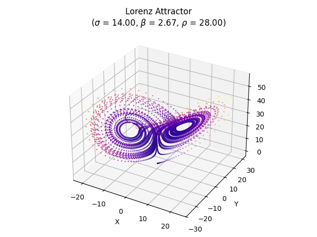

# Python Phd Course Report
## Kapenekakis Antheas

The Lorenz system is a set of differential equations proposed by Edward Lorenz 
in 1963. When the equations are graphed, they produce a 3D plot of a strange
attractor that forms the shape of a butterfly.
In this project, we will use a basic numerical differentiator to solve the Lorenz
system of equations and plot the results, as a set of 2D and 3D plots.
In addition, we will color the plots using a colormap, save the produced plots
and results in PNG and CSV files, and create tests to verify the functionality
of the project.

The differential equations that describe the Lorenz system are:
$$\begin{aligned}
\frac{dx}{dt} = \sigma(y - x) \\
\frac{dy}{dt} = x(\rho - z) - y \\
\frac{dz}{dt} = xy - \beta z
\end{aligned}$$
where $x$, $y$, and $z$ are the state variables, and $\sigma$, $\rho$, and $\beta$
are the system parameters.

To solve the differential equations, we will use the Euler method, which is a
simple numerical method to solve ordinary differential equations.
Essentially, we will use a small time step on a discrete time space, and
on each time step, we will update the state variables by adding the product of
the time step and their derivatives.
$$\begin{aligned}
x_{n+1} = x_n + \frac{dx}{dt} t_{\delta} \\
y_{n+1} = y_n + \frac{dy}{dt} t_{\delta} \\
z_{n+1} = z_n + \frac{dz}{dt} t_{\delta}
\end{aligned}$$

To color the plots, we will calculate the magnitude of the velocity vector
of the differential equations and use it on a scatter plot with a colormap.
$$v = \sqrt{\left(\frac{dx}{dt}\right)^2 + \left(\frac{dy}{dt}\right)^2 + \left(\frac{dz}{dt}\right)^2}$$

One of the problems of the Lorenz system is that it is not stable in regards to
the initial conditions.
Since no initial conditions were provided as part of the project, we will use
random ones, generated between 0 and 1.
To ensure reproducibility, we pin Numpy's random seed to 128 and use the
`numpy.random.rand` function to generate the initial conditions.

## Project Structure
## Structure
The project will be implemented in Python, using the NumPy and Matplotlib libraries.
The project will be structured in the following way:
- `lorenz.py`: The main module that will contain the implementation of the Lorenz system.
- `test_lorenz.py`: The test module that will contain the tests for the Lorenz system.
- `diff.py`: The module that will contain the implementation of the Euler method.
- `test_diff.py`: The test module that will contain the tests for the Euler method.

## Installation
To ensure the reproducibility of the project, we will use a virtual environment
combined with the `pip-tools` tool `pip-compile`.
We begin by placing the dependencies in the `requirements.in` file:
```
numpy
matplotlib
pytest
jupyterlab
```
Then, we compile the dependencies to the `requirements.txt` file,
where they are frozen to the exact version:
```bash
# Only run to update dependencies
# Skip for just running the code
pip install pip-tools
pip-compile
```

Finally, we install the dependencies in a virtual environment:
```bash
python -m venv venv
# substitute with venv\Scripts\activate.bat on Windows
source venv/bin/activate
pip install -r requirements.txt
```

This ensures that years down the line, the project can be easily reproduced
even if the dependencies have had breaking changes.

A gitignore file is included to ignore the virtual environment.
However, it does not ignore the output plots, as they are used in this
document in markdown form and are needed for this readme to function.

## Data Analysis
To execute the differentiation and plotting of the Lorenz system, we will use
a Jupyter notebook, called `lorenz.ipynb`, which will contain the examples
and visualizations of the Lorenz system.

The notebook was created in Visual Studio Code.
However, barring that, it can be run in Jupyter Lab:
```bash
venv/bin/jupyter lab
```
The project saves the plots and results in the `./res` folder.
Plots are saved as PNG files in `./res/fig`, and results are saved as CSV files
in `./res/fig`.
The file `./res/csv/hyper.csv` contains the hyperparameters that were used
in each system.

For both this readme and the notebook, I will export them as PDFs and include
them in the project folder.
Therefore, no files need to be run to see the results of the project.

```bash
pandoc lorenz.ipynb -o lorenz.pdf
pandoc README.md -o report.pdf
```

## Experimental Setup
As per the project description, we will use the following hyperparameters
to generate a set of Lorenz systems.
For all runs, we will use a time delta of 0.01 and 5000 points, for a total time
of 50s.

| Index | $\sigma$ | $\beta$ | $\rho$ |
| ----- | -------- | ------- | ------ |
| 1     | 10       | 8/3     | 6      |
| 2     | 10       | 8/3     | 16     |
| 3     | 10       | 8/3     | 28     |
| 4     | 14       | 8/3     | 28     |
| 5     | 14       | 13/3    | 28     |

For the plots themselves, we will use a subplot of 1x3 for the 2D plots (XY, XZ, YZ),
and a square plot for the 3D plot.
For both plots, we will use scatter plots with a colormap, where the color is
determined by the magnitude of the velocity vector.

## Performance
After evaluating the performance of the system, it was found that just
4% of the time was spent on the Euler method (38ms), while the rest of the time
was spent on plotting (920ms), with plotting taking 71% of the time (882ms)
and saving taking 25% of the time (234ms) respecively.
This is due to using a scatter plot instead of a line plot, which was required
to add the colormap.
As such, optimizing the differentiation method would not provide a meaningful
improvement in performance.

5000 points were used, as that resulted in the most legible and appealing plots.

## Results

## Run 1


## Run 2


## Run 3


## Run 4



## Run 5

